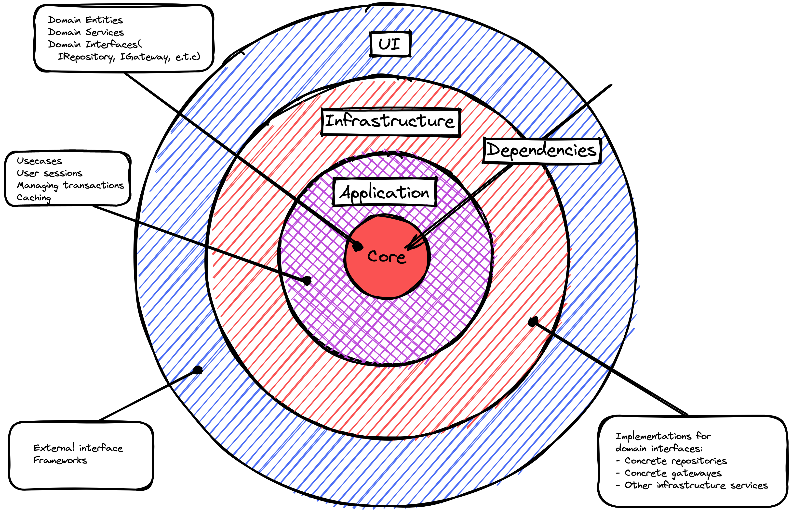

## Description

Coupling is a common software development problem. It reduces ability to maintain and change system
following changed requirements. While coupling is a fundamental problem, it is not possible to eliminate it in the software system. But it is possible to reduce coupling by eliminating those kinds of it, which does not bring any advantages. Necessary coupling is directed from less important and frequently changed components to the most valuable and stable components which contain main value of application.

Usually application can be divided to core business logic, which is responsible for solving real world problems, saving time, money. Sometimes it is easy to recognise this logic by the fact, that it may be not automated with computer systems and implemented in other way. Like accountant may calculate balance with or without computer. Computer system just makes this faster and easier. 

The second part is other logic, which is required for core business functionality to exist. It connects business to the outer world with APIs, databases, sends messages or provides access to the file system. This layer also known as `infrastructure`. Saying differently infrastructure functionality is such code, that is required for application to operate, but does not provide any competitieve advantages for it.

It is very likely that infrastructure layer functionality changes more often, than core business. We can
change databases, messaging systems, we even can deside to change architecture and replace file system calls with third party provided database products, change native application to be web based e.t.c. In all such cases core business not changes. But if we couple out business to infrastructre, making such
changes will be hard if in some cases even possible. Such a way we can make changes to the system with less pain. Inversion of dependencies also makes application framework agnostic. All framework, database, connectivity and other not core logic becomes just a plugin for our core domain.

Domain models and business functionality in the center. Other layers are surround core. Dependencies are directed towards the center. Amount of layes may vary. But the principle, when of dependencies is always the same.

The typical layer structure consists of 4 layers:

- `Domain`: business objects
- `Application`: usecases and concrete interface to business
- `Infrastructure`: databases, external service connectivity, file system...
- `UI`: frameworks, web, CLI or other ways to use application

Layers are coupled only with interfaces. For this purpose each inner level defines an interface for
the external layer and external layer implements this interface. Later on app configuration this implementations are injected and inner level can use them through the interface. This configuration usually happend on the highest level of the application. 

That said onion architecture heavily relied on `SOLID` `Inversion of controle` principle.

Important to note: normally it is a good practice to make path from external layer to the objects it uses as short as possible. In other words best case scenario when layer uses object internal to it, then it can use objects from immediate neibhour(it will always be closest internal layer). Then second neibhour and deeper. Better to avoid last case. For example controller should not access business 
entities or repositories directly. But onion architecture allows all scenarios until dependencies directed towards center.

## Pros

- It allows to reduce unnecessary coupling(business, infrastructure, UI, e.t.c.)
- Eases maintenence and growth of the system
- Core layers can be shipped independently from infrastructure and changing infrastructure does not affect core.

## Cons

- Tied to OOP

## Application Usecases

## Refernces

- [The Onion Architecture : part 1](https://jeffreypalermo.com/2008/07/the-onion-architecture-part-1/)
- [The Onion Architecture : part 2](https://jeffreypalermo.com/2008/07/the-onion-architecture-part-2/)
- [Best Practice - An Introduction To Domain-Driven Design](https://docs.microsoft.com/en-us/archive/msdn-magazine/2009/february/best-practice-an-introduction-to-domain-driven-design)